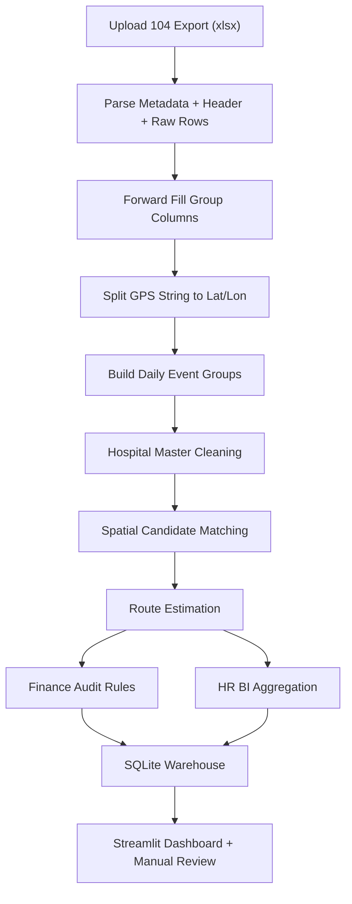

# Software Design Document (SDD) v2

## 1. 文件目的

本版 SDD 依據目前提供的真實樣本檔重新整理，目標是讓系統設計從「概念可行」提升為「可直接進入實作」。  
本文件特別修正了初稿中對資料來源的幾個重要假設，避免後續開發建立在錯誤前提上。

---

## 2. 樣本檔實測結果摘要

### 2.1 `employees.csv`

實際欄位：

| 欄位 | 型別觀察 | 備註 |
|---|---|---|
| 員工編號 | string | 目前看起來應作為員工主鍵 |
| 姓名 | string | 展示用途，不宜作主鍵 |
| Home_Lon | float | 住家經度 |
| Home_Lat | float | 住家緯度 |

觀察：
- 目前樣本只有 1 筆。
- 初稿中的 `Base_Commute_km` 並不存在。
- v2 決議保留程式泛用性，`employees.csv` 應新增通勤基準相關欄位，支援不同公司的出勤制度。

### 2.2 `existing_clients.csv`

實際欄位：

| 欄位 | 型別觀察 | 備註 |
|---|---|---|
| 機構代碼 | string | 不可用數值型讀取，需保留前導 0 |
| 機構名稱 | string | 名稱可能與代碼不完全一致 |

觀察：
- 共 227 筆。
- `機構代碼` 有重複值 2 筆。
- 出現同一 `機構代碼` 對應不同 `機構名稱` 的情況，代表不能假設這份檔案一定乾淨。

### 2.3 `hospitals.csv`

實際欄位：

| 欄位 | 型別觀察 | 備註 |
|---|---|---|
| 機構代碼 | string | 不可用數值型讀取 |
| 機構名稱 | string | 院所主名稱 |
| 電話 | string | 可空 |
| 縣市區名 | string | 可空 |
| 地址 | string | 主地址 |
| 科別 | string | 可空，且有尾端逗號 |
| Response_Address | string | 可空 |
| Response_X | float | 經度 |
| Response_Y | float | 緯度 |
| Unnamed: 9 | empty | 全空欄，應匯入前移除 |

觀察：
- 共 23,927 筆。
- `Response_X` / `Response_Y` 皆有值，可作為空間匹配主依據。
- 存在 112 筆完全重複列，113 組重複 `機構代碼 + 機構名稱`。
- 不應直接把原始 `hospitals.csv` 視為乾淨主檔，需先做標準化與去重。

### 2.4 104 打卡匯出 `20260420打卡資料匯出_sample.xlsx`

實際工作表：
- 單一工作表：`20260420`

實際結構：
- 前 5 列為報表資訊，不是資料列。
- 第 6 列為正式欄位名稱。
- 正式資料共 236 列。
- `#` 欄位是一個「群組識別」，不是每列唯一流水號。

實際欄位：

| 欄位 | 型別觀察 | 備註 |
|---|---|---|
| # | float / group id | 一組代表某員工某工作日的一批事件 |
| 員工編號 | string | 需要向下填補 |
| 姓名 | string | 需要向下填補 |
| 部門 | string | 需要向下填補 |
| 工作日期 | string | 需要向下填補 |
| 應刷卡時間 | string | 常只出現在上/下班事件列 |
| 實際打卡時間 | string | 中間 GPS 點通常只填這欄 |
| 卡別 | string | 常見值為上班/下班，中間路徑點為空 |
| 打卡地址 | string | 實際為 `緯度,經度` |
| 比對結果 | string | 常見值：正常、未打卡、遲到、早退 |
| 異常處理 | string | 多數為空 |
| 來源 | string | 常見值：GPS打卡、忘刷申請 |
| 備註 | string | 多數為空 |
| 超時出勤 | string | 多數為空 |
| 超時出勤原因 | string | 多數為空 |
| 超時出勤說明 | string | 多數為空 |

重要觀察：
- 65 個 `#` 群組對應 65 個「員工 x 工作日」事件組。
- 每組 2 到 7 列不等，不是固定兩筆上下班。
- 多數群組只有 2 列有 `卡別`，中間移動點只有 `實際打卡時間 + 打卡地址 + 來源`。
- `打卡地址` 雖然欄名叫地址，實際內容是 GPS 字串，不應拿去做地址文字正規化主流程。
- `應刷卡時間`、`卡別`、`比對結果` 大量缺值是資料結構特性，不一定是髒資料。

---

## 3. 修訂後的系統定位

本系統應定義為：

> 一個以「104 打卡事件群組」為來源、結合院所主檔與客戶名單的地端 BI 與稽核平台。  
> 主要產出包含：每日拜訪軌跡語意化、業務拜訪客戶判別、財務報銷輔助稽核、以及 HR 趨勢型分析。

本系統不應在 v1 被定義成完全自動核決系統，而應是：
- 自動計算
- 顯示信心
- 提供人工覆核
- 保留覆寫軌跡

---

## 4. 修訂後的核心設計原則

### 4.1 以「事件流」而非「單筆打卡」建模

104 匯出資料不是一列一個完整出勤事件，而是：

- 一個 `#` 群組
- 對應一位員工
- 對應一個工作日期
- 包含上班、下班、以及 0 到 N 個中途 GPS 點

因此核心處理單位應為：

1. 原始事件列 `raw_check_events`
2. 單日事件群組 `attendance_day_group`
3. 單日路徑結果 `daily_route_summary`

### 4.2 財務與 HR 分析要分層

同一份軌跡估算結果可以共用，但不可直接把同一套結果當成：
- 財務核銷唯一依據
- HR 紀律懲處唯一依據

建議拆成：
- `Finance Audit View`：偏保守、需可覆核、要有版本與覆寫紀錄
- `HR BI View`：偏趨勢分析、不可單獨作懲處依據

### 4.3 先做資料治理，再做演算法

由於 `employees.csv`、`existing_clients.csv`、`hospitals.csv` 都是手動維護檔：
- 匯入時必須先做欄位驗證
- 去重
- 型別標準化
- 主鍵檢查

不能假設手工檔永遠正確。

---

## 5. 建議的資料流程

---

## 6. 修訂後的資料模型

SQLite 建議至少拆成下列資料表。

### 6.1 `employee_master`

來源：`employees.csv`

| 欄位 | 型別 | 說明 |
|---|---|---|
| employee_id | TEXT PK | 對應 `員工編號` |
| employee_name | TEXT | 對應 `姓名` |
| home_lon | REAL | 住家經度 |
| home_lat | REAL | 住家緯度 |
| office_lon | REAL NULL | 可選，供需進公司之公司使用 |
| office_lat | REAL NULL | 可選，供需進公司之公司使用 |
| base_commute_km | REAL NULL | 建議新增，作為公平一致的固定通勤扣除基準 |
| base_commute_rule | TEXT NULL | 例如 `fixed_km` / `home_to_office` / `none` |
| department_default | TEXT NULL | 可選，用於主檔校驗 |
| is_active | INTEGER | 1/0 |
| updated_at | TEXT | 匯入時間 |

說明：
- 因實際檔案沒有 `Base_Commute_km`，v2 正式要求補入 `base_commute_km`。
- 對於像本案這種業務分散全台、平時不需進公司的情境，建議以公司定義的「公平基準通勤值」維護於主檔，而不是推估真實住家通勤。
- `office_lon/office_lat` 仍保留為泛用欄位，供其他公司採辦公室基準模式時使用。

### 6.2 `hospital_master_raw`

來源：`hospitals.csv`

用途：
- 保存原始匯入內容，供追溯與重跑清洗。

### 6.3 `hospital_master_clean`

清洗後院所主檔。

| 欄位 | 型別 | 說明 |
|---|---|---|
| hospital_id | TEXT PK | 對應 `機構代碼` |
| hospital_name | TEXT | 標準化名稱 |
| address | TEXT | 原始地址 |
| normalized_address | TEXT NULL | 正規化地址 |
| specialty | TEXT NULL | 科別清洗後 |
| lon | REAL | `Response_X` |
| lat | REAL | `Response_Y` |
| city_district | TEXT NULL | 縣市區名 |
| source_status | TEXT | `clean` / `duplicated` / `conflict` |
| updated_at | TEXT | 匯入時間 |

規則：
- 刪除 `Unnamed: 9`
- 先消除完全重複列
- 對重複 `機構代碼` 保留一筆主資料，其餘標示衝突狀態

### 6.4 `client_master`

來源：`existing_clients.csv`

| 欄位 | 型別 | 說明 |
|---|---|---|
| hospital_id | TEXT PK | 對應 `機構代碼` |
| client_name | TEXT | 原始名稱 |
| client_status | TEXT | 固定為 `existing` |
| source_status | TEXT | `clean` / `conflict` |
| updated_at | TEXT | 匯入時間 |

規則：
- 若相同 `機構代碼` 對應不同名稱，保留代碼但標記 `conflict`

### 6.5 `raw_check_events`

來源：104 匯出逐列資料。

| 欄位 | 型別 | 說明 |
|---|---|---|
| event_uid | TEXT PK | 建議 `import_batch_id + sheet_name + row_no` |
| import_batch_id | TEXT | 一次匯入批號 |
| source_sheet | TEXT | 工作表名 |
| source_row_no | INTEGER | Excel 原始列號 |
| group_no | TEXT | 對應 `#` |
| employee_id | TEXT | 員工編號 |
| employee_name | TEXT | 姓名 |
| department | TEXT | 部門 |
| work_date | TEXT | 工作日期 |
| scheduled_time | TEXT NULL | 應刷卡時間 |
| actual_time | TEXT NULL | 實際打卡時間 |
| card_type | TEXT NULL | 上班/下班/NULL |
| gps_raw | TEXT NULL | 原始 GPS 字串 |
| gps_lat | REAL NULL | 解析後緯度 |
| gps_lon | REAL NULL | 解析後經度 |
| compare_result | TEXT NULL | 正常/遲到/早退/未打卡 |
| exception_action | TEXT NULL | 異常處理 |
| source_type | TEXT NULL | GPS打卡/忘刷申請 |
| note | TEXT NULL | 備註 |
| overtime_flag | TEXT NULL | 超時出勤 |
| overtime_reason | TEXT NULL | 超時出勤原因 |
| overtime_comment | TEXT NULL | 超時出勤說明 |
| created_at | TEXT | 匯入時間 |

### 6.6 `attendance_day_group`

由 `raw_check_events` 聚合而成，一筆代表一位員工一天。

| 欄位 | 型別 | 說明 |
|---|---|---|
| attendance_uid | TEXT PK | 建議 `employee_id + work_date + group_no + import_batch_id` |
| import_batch_id | TEXT | 匯入批號 |
| group_no | TEXT | 104 群組號 |
| employee_id | TEXT | 員工 |
| work_date | TEXT | 日期 |
| department | TEXT | 部門 |
| event_count | INTEGER | 該組總列數 |
| gps_event_count | INTEGER | 有 GPS 的列數 |
| first_actual_time | TEXT NULL | 最早實際打卡 |
| last_actual_time | TEXT NULL | 最晚實際打卡 |
| first_card_time | TEXT NULL | 最早上班卡別時間 |
| last_card_time | TEXT NULL | 最晚下班卡別時間 |
| compare_result_summary | TEXT NULL | 日層級摘要 |
| source_quality_status | TEXT | `ok` / `missing_gps` / `missing_clock` / `manual_only` |
| created_at | TEXT | 產生時間 |

### 6.7 `route_stop_match`

每個 GPS 點匹配出的候選院所。

| 欄位 | 型別 | 說明 |
|---|---|---|
| stop_match_uid | TEXT PK | 唯一鍵 |
| event_uid | TEXT | 對應原始事件 |
| attendance_uid | TEXT | 對應單日群組 |
| seq_no | INTEGER | 當日順序 |
| candidate_rank | INTEGER | 1~N |
| hospital_id | TEXT | 候選院所 |
| beeline_meter | REAL | 直線距離 |
| match_score | REAL | 綜合分數 |
| is_existing_client | INTEGER | 是否既有客戶 |
| is_selected | INTEGER | 是否為系統選定結果 |
| selected_by | TEXT | `system` / `manual` |
| created_at | TEXT | 建立時間 |

### 6.8 `daily_route_summary`

每天最終估算結果。

| 欄位 | 型別 | 說明 |
|---|---|---|
| attendance_uid | TEXT PK | 對應單日群組 |
| route_mode | TEXT | `offline_estimate` / `google_maps` |
| route_start_type | TEXT | `home` / `office` / `unknown` |
| route_end_type | TEXT | `home` / `office` / `unknown` |
| total_stop_count | INTEGER | 當日停留點數 |
| matched_stop_count | INTEGER | 成功語意化點數 |
| estimated_total_km | REAL | 總里程 |
| estimated_business_km | REAL | 公務里程 |
| estimated_travel_min | REAL | 交通時間 |
| route_confidence | REAL | 整體信心分數 |
| route_notes | TEXT NULL | 備註 |
| rule_version | TEXT | 計算規則版本 |
| calculated_at | TEXT | 計算時間 |

### 6.9 `finance_audit_result`

| 欄位 | 型別 | 說明 |
|---|---|---|
| attendance_uid | TEXT PK | 對應單日群組 |
| employee_claim_km | REAL NULL | 員工申請里程或月度彙整匯入值 |
| base_commute_deduction_km | REAL NULL | 通勤扣除 |
| approved_business_km | REAL | 建議核准公務里程 |
| km_variance_pct | REAL NULL | 與申請值誤差百分比 |
| audit_light | TEXT | `green` / `yellow` / `red` / `gray` |
| fuel_rate | REAL | 油資參數 |
| fuel_subsidy | REAL | 油資補助 |
| maintenance_base | REAL | 固定維修補貼 |
| maintenance_rate | REAL | 變動維修費率 |
| maintenance_subsidy | REAL | 維修補貼 |
| per_diem_amount | REAL | 日當費 |
| audit_status | TEXT | `pending` / `approved` / `rejected` / `manual_override` |
| reviewer_note | TEXT NULL | 覆核說明 |
| rule_version | TEXT | 規則版本 |
| updated_at | TEXT | 更新時間 |

補充：
- 若現行正式來源仍是每月 `.docx` 里程報告，v1 建議由業務助理整理成「每員工每月總里程」匯入檔後再進行核對。
- 系統應預留月度匯入表，例如 `monthly_claims.csv`，欄位建議至少包含：`year_month`, `employee_id`, `claimed_km`, `claim_source`, `submitted_at`, `remark`。

### 6.10 `manual_override_log`

| 欄位 | 型別 | 說明 |
|---|---|---|
| override_id | TEXT PK | 唯一鍵 |
| target_table | TEXT | 被覆寫資料表 |
| target_id | TEXT | 被覆寫主鍵 |
| field_name | TEXT | 欄位名 |
| old_value | TEXT NULL | 舊值 |
| new_value | TEXT NULL | 新值 |
| override_reason | TEXT | 覆寫原因 |
| override_by | TEXT | 覆寫者 |
| override_at | TEXT | 覆寫時間 |

---

## 7. 匯入與清洗規則

### 7.1 104 匯出檔解析規則

1. 固定 `skiprows=5`。
2. 將第 6 列作為 header。
3. 對 `#`、`員工編號`、`姓名`、`部門`、`工作日期` 進行 `ffill`。
4. 保留原始 Excel 列號，方便追溯錯誤。
5. `打卡地址` 以逗號切分為 `gps_lat`, `gps_lon`。
6. 若 `打卡地址` 缺值，不直接判為錯誤，需結合 `卡別` / `比對結果` 判斷是否是未打卡情境。

### 7.2 GPS 解析規則

建議採用：
- 先 `strip()`
- 再以第一個逗號分割
- 左值視為 `Lat`
- 右值視為 `Lon`

不要在 v1 對這欄做地址語意正規化，因為它不是地址字串。

### 7.3 院所主檔清洗規則

1. 刪除全空欄位。
2. `機構代碼` 強制轉字串。
3. 移除完全重複列。
4. 對同 `機構代碼` 多筆資料做衝突檢查：
   - 若名稱/座標完全一致，保留一筆。
   - 若不一致，標示為 `conflict` 並保留人工檢視清單。
5. `科別` 去除尾端標點。

### 7.4 既有客戶檔清洗規則

1. `機構代碼` 強制轉字串。
2. 依 `機構代碼` 去重。
3. 若同代碼名稱不一致，標記 `conflict`。
4. 只把狀態視為「既有客戶清單」，不要把名稱當唯一真相。

---

## 8. 空間匹配設計

### 8.1 基本策略

對每個有 GPS 的事件點：

1. 先用 `cKDTree` 在 `hospital_master_clean` 中取 Top 5 最近候選
2. 計算直線距離
3. 產生 `match_score`
4. 選出 `is_selected = 1` 的預設院所

### 8.2 不建議直接以最近點等於真實拜訪對象

因醫療院所密度高，建議加入以下保護：

- 距離閾值：例如超過 300m 或 500m 時標記 `low_confidence`
- 同地址多院所：標記 `ambiguous`
- 重複到訪歷史：若同員工近期經常到訪同院所，可加分
- 既有客戶狀態：可作標記，但不應凌駕距離事實

### 8.3 輸出必須保留信心資訊

不能只輸出單一院所名稱，還要保存：
- Top N 候選
- 距離
- 分數
- 是否人工改判

---

## 9. 路徑與里程引擎修訂

### 9.1 v2 不建議強制套用 `Home -> A -> B -> Home`

由於真實資料只有 GPS 事件流，沒有可靠欄位能保證：
- 一定從家出發
- 一定回家結束
- 中途未回公司

因此 v2 建議改成可配置起訖點策略：

- `home_based`
- `office_based`
- `first_last_gps_only`
- `hybrid_rule_based`

### 9.2 離線模式

預設：
- 點對點直線距離 × Detour Index
- 預設 Detour Index 應改成可設定參數，而非寫死 1.35
- 交通時間應由城市層級速度參數估算

### 9.3 Google Maps 模式

只有在以下條件下啟用：
- API Key 已設定
- 當日路徑已通過基本清洗
- 路徑段數在可接受範圍內

必須加入：
- cache
- timeout
- retry
- quota exceeded handling
- 結果來源標記

### 9.4 公務里程邏輯修訂

本案決議如下：

- `employees.csv` 新增 `base_commute_km`
- `office_lon`, `office_lat` 保留為選配欄位
- 通勤扣除預設採 `fixed_km` 模式，以公司定義的公平一致基準值處理

規則建議：
- `base_commute_km` 代表單趟合理通勤公里數
- 若公司未提供更精準制度，可用「合理 30 分鐘內通勤」換算出的公里數作為制度基準，再由 HR 維護進主檔
- 單日扣除值預設為 `base_commute_km * 2`
- 若員工當日資料顯示明顯不適用固定扣除，例如非完整日出勤或特殊核准情境，可由主管手動覆寫

---

## 10. 財務稽核設計修訂

### 10.1 燈號規則建議

| 燈號 | 條件 | 建議行為 |
|---|---|---|
| green | 誤差 <= 15% | 自動建議核准 |
| yellow | 15% < 誤差 <= 30% | 主管覆核 |
| red | 誤差 > 30% | 凍結自動核准 |
| gray | 無申請值或資料不足 | 僅顯示估算，不下判定 |

### 10.2 日當費規則正式定義

本案決議不再以「打卡點 >= 2」作為日當主判準，而改成依實際制度計算：

- 正常出勤且按時繳交日報表：`300`
- 僅出勤半天：`150`
- 半天出勤且公司已供一餐：`0`
- 正常出勤且公司已供兩餐：`0`

因此系統需新增或整合以下欄位來源：
- `attendance_status`：正常出勤 / 半天出勤 / 異常
- `daily_report_submitted`：是否按時繳交日報
- `meals_provided_count`：公司當日供餐數量，建議值 `0` / `1` / `2`

若 v1 尚無日報表系統串接，可先提供人工匯入或手動標記。

並將此邏輯標記為 `rule_version` 可調整規則。

### 10.3 必須支援人工覆寫

實務上以下欄位都應允許人工覆寫：
- 匹配客戶
- 公務里程
- 油資補貼
- 日當費
- 燈號結果

且所有覆寫都要寫入 `manual_override_log`。

---

## 11. HR BI 模組修訂

### 11.1 有效工時

建議公式：

`effective_field_minutes = raw_span_minutes - estimated_travel_minutes`

但此指標應標示為：
- 分析性指標
- 不直接等同工時認定

`raw_span_minutes` 建議定義為：
- `last_actual_time - first_actual_time - statutory_break_minutes`

其中 `statutory_break_minutes` 在本案 v1 預設至少扣除 30 分鐘。
- 若未來公司希望依勞動契約固定扣除 60 分鐘午休，可改由參數切換。

### 11.2 趨勢分析輸出

建議至少提供：

1. 出勤異常率  
   分子：遲到、早退、未打卡、忘刷申請等異常日數  
   分母：有排班或有事件的工作日數

2. 超時出勤比例  
   分子：`超時出勤` 標記日數  
   分母：工作日數

3. 客戶覆蓋趨勢  
   依日/週/月統計：
   - 既有客戶拜訪次數
   - 新客戶開發次數
   - 無法判定次數

4. 行程密度趨勢  
   - 每日 GPS 點數
   - 每日有效停留點數
   - 每日估算移動距離

### 11.3 治理聲明

文件中應明文註記：

> HR BI 指標為管理分析用途，不作為單一懲處依據。  
> 任何正式人事處置仍須結合人工審查與其他佐證資料。

---

## 12. Streamlit UI 修訂建議

### 12.1 Sidebar

- 上傳區：
  - 104 打卡匯出檔
  - `hospitals.csv`
  - `existing_clients.csv`
  - `employees.csv`
- 參數區：
  - 路徑模式切換
  - Detour Index
  - Google Maps API 開關與 Key
  - 油資費率
  - 維修費率
  - 燈號容差
- 篩選區：
  - 日期區間
  - 員工
  - 部門
  - 燈號
  - 資料品質狀態

### 12.2 主畫面頁籤

1. `每日事件與路徑`
   - 事件時間軸
   - GPS 點地圖
   - 候選院所與距離
   - 系統選定與人工改判

2. `財務稽核`
   - 申請里程 vs 系統估算
   - 燈號清單
   - 油資/維修/日當建議值
   - 人工覆寫介面

3. `HR BI`
   - 工時 vs 交通時間散點圖
   - 異常率趨勢
   - 客戶覆蓋趨勢
   - 行程密度分布

4. `資料品質`
- 匯入錯誤
- 重複主鍵
- 無法解析 GPS
- 無法匹配院所
- 主檔衝突清單
- 日報/供餐/申請里程等外部資料缺漏

---

## 13. Python 模組切分修訂

建議改為以下模組，而不是把多種責任混在同一檔。

### 13.1 `db_manager.py`

負責：
- SQLite schema 初始化
- import batch 管理
- upsert
- query helpers

### 13.2 `master_data_service.py`

負責：
- `employees.csv`
- `hospitals.csv`
- `existing_clients.csv`
的驗證、清洗、去重、匯入

### 13.3 `checkin_importer.py`

負責：
- 104 Excel 解析
- metadata 跳過
- forward fill
- GPS 拆欄
- 原始事件入庫

### 13.4 `matcher.py`

負責：
- KDTree 建立
- 候選院所查找
- match score
- 低信心標記

### 13.5 `routing_engine.py`

負責：
- 日路徑排序
- 離線估算
- Google Maps 查詢
- cache/fallback

### 13.6 `finance_auditor.py`

負責：
- 公務里程計算
- 通勤扣除
- 燈號
- 津貼計算
- 月度申請里程彙整比對

### 13.7 `bi_service.py`

負責：
- 日/週/月彙總
- 趨勢指標
- 視覺化查詢資料集

### 13.8 `app.py`

負責：
- Streamlit UI
- 互動流程
- 人工覆寫操作
- 主管手動改判拜訪客戶

---

## 14. 錯誤處理設計

### 14.1 錯誤分類

| 等級 | 類型 | 行為 |
|---|---|---|
| fatal | 缺必要欄位、檔案無法解析、主檔主鍵全毀 | 停止匯入 |
| warn | 重複鍵、院所衝突、部分 GPS 缺漏 | 允許匯入但顯示警示 |
| info | 備註缺值、可選欄位空白 | 僅記錄 |

### 14.2 需要明確捕捉的情境

- Excel header 不符預期
- `打卡地址` 無法切成兩段
- 座標超出台灣合理範圍
- 院所主檔缺少座標
- 員工主檔找不到員工編號
- 客戶檔代碼衝突
- API timeout / quota exceeded
- 重複匯入同一批資料

---

## 15. 測試策略

### 15.1 單元測試

- 104 匯出 `skiprows=5` 與 header 偵測
- `ffill` 後群組欄位是否完整
- GPS split 解析
- 院所主檔去重
- 既有客戶衝突檢查
- 燈號邊界值
- 日當費門檻
- 法定休息時間扣除
- 月度申請里程匯入比對

### 15.2 整合測試

- 匯入一週 104 檔後生成日彙總
- KDTree 匹配與既有客戶標記
- 路徑 fallback 機制
- 人工覆寫後報表重新計算

### 15.3 回歸測試

- 同一批資料重匯結果一致
- 規則版本切換後舊資料仍可追溯

---

## 16. v1 實作範圍建議

### 16.1 建議先做

1. 主檔清洗與匯入
2. 104 匯出解析與事件群組化
3. 離線距離估算
4. KDTree 候選匹配
5. 基本財務燈號與人工覆核
6. 基本 HR 趨勢圖

### 16.2 建議延後

- Google Maps 真實路徑
- 自動通勤扣除精準化
- 歷史偏好匹配加權
- 複雜審批流程

---

## 17. 已確認決策

以下項目已於需求確認階段定案：

1. `employees.csv` 新增 `base_commute_km`，並保留 `office_lon/office_lat` 作為泛用欄位。  
   本案預設採固定通勤扣除模式，以公司定義的公平一致基準值執行。

2. 財務稽核的申請里程來源，v1 採「業務助理整理月度總里程匯入檔」模式。  
   原始 `.docx` 月報可作佐證，但不作為系統直接解析來源。

3. 日當費不再以打卡點數作為主要條件。  
   改依「正常出勤且按時繳交日報表給 300、半天出勤給 150、半天若已供一餐則不給、全天若已供兩餐則不給」的制度實作。

4. HR 模組中的總工時計算，v1 至少扣除 30 分鐘法定休息時間。  
   後續可再參數化支援依契約固定扣除 60 分鐘午休。

5. 主管在 UI 中允許手動改判拜訪客戶。  
   原因是實務上可能存在醫師、藥師、餐敘、RTD、seminar 等非院所主檔場景；所有改判都必須留痕。

---

## 18. 結論

根據本次樣本檢查，原始初稿的整體方向是對的，但需要做三個關鍵修正：

1. 104 打卡匯出要以「群組式事件流」建模，而非兩筆上下班記錄。
2. 主檔資料要先納入資料治理流程，不能直接當乾淨真相。
3. 財務與 HR 雖可共用估算結果，但必須在規則、治理、與 UI 上分層。

在這些修正納入後，此專案已具備進入 v1 實作設計的條件。
